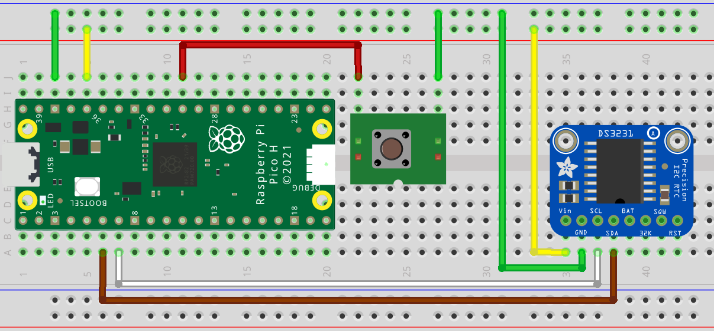

# Pi Pico command RTC (real time clock)

An RTC (real time clock) integrated with the Pi Pico and a command console 
to read and set the time.

This project is an extension of previous Pi Pico projects, specifically the 
Pi Pico command console project, Pi Pico linux C multicore project, and the 
Pi Pico linux C intro project.

## Prerequisites

- Pi Pico MCU
- DS3231 RTC module
- Optional USB-UART Bridge
- Breadboard with jumper wires
- USB cable to connect the Pi Pico to the workstation
- Linux workstation (Fedora 37 used in the demo)
- Serial terminal application (screen, minicom, putty, etc.)

## Build

Assuming you already have a development environment setup as was used in the
previous Pi Pico projects then you can clone this repo, create a build 
directory, run cmake, then make, and lastly copy the resulting clock.uf2 
file to the Pi Pico.

> git clone https://github.com/bnielsen1965/pi-pico-c-rtc.git

> cd pi-pico-c-rtc

> mkdir build

> cd build

*skip the export step if you already exported the pico-sdk path in your environment*
> export PICO_SDK_PATH=~/Embedded/pico-sdk/

> cmake ..

> make

*connect Pi Pico with USB cable and start with bootsel held down*
> cp clock.uf2 /run/media/$(whoami)/RPI-RP2/

## Serial Connection

It is recommended to use a USB to UART bridge for the serial console but it is 
possible to get by with the Pi Pico USB serial console. When using the Pi Pico 
USB serial interface be aware of potential issues when switches the Pi Pico 
between boot rom mode and execution mode as the USB port will need to switch 
from a serial interface to a mass storage device.

## Circuit

A DS3231 module is used for the RTC, is powered by the 3.3VDC output from the 
Pi Pico, and is connected to the I2C1 pins 6 and 7 on the Pi Pico.

Note that there are various versions of the DS3231 module available on 
the market and the pin outs will vary. When hooking up your DS3231 module 
refer to your module's documentation for proper pin connections.

## Serial Commands

With the serial terminal connected to the Pi Pico you can enter commands 
to read and set the RTC date and time.

[serial-commands.webm](./serial-commands.webm)

## Reference Links

- Fedora Linux: [https://getfedora.org/](https://getfedora.org/)
- Raspberry Pi Pico: [https://www.raspberrypi.com/products/raspberry-pi-pico/](https://www.raspberrypi.com/products/raspberry-pi-pico/)
- Pi Pico SDK: [https://github.com/raspberrypi/pico-sdk](https://github.com/raspberrypi/pico-sdk)
- DS3231 RTC module: [Amazon search for "ds3231"](https://www.amazon.com/s?k=ds3231)

## Setup

The development environment used to create the demo is the same environment 
used in previous pi-pico-linux-c projects. Some brief instructions are 
included here to assist in setting up a new environment.

### Workstation Setup

The Linux workstation will require some software packages installed
before developing an application for the Pi Pico. You can use your
favored editor and terminal application, but you will also need *git*, *cmake*, and *g++*.

(Fedora 37 install command)

> sudo dnf install git cmake g++

The ARM cross compilers and libraries are also needed to compile 
and link binaries for the ARM processor on the Pi Pico.

(Fedora 37 install commands)

> sudo dnf install arm-none-eabi-gcc-cs

> sudo dnf install arm-none-eabi-gcc-cs-c++

> sudo dnf install arm-none-eabi-newlib

### Clone Pi Pico SDK

Create a project folder in your home directory where the work will be performed.
In this example we will be using the working directory named *Embedded*.

> cd ~

> mkdir Embedded

> cd Embedded

The Pi Pico SDK can be cloned from the raspberrypi github
repository.

(Clone pico-sdk project and update submodules)

> git clone https://github.com/raspberrypi/pico-sdk

> cd pico-sdk

> git submodule update --init

Return to the project directory and export the path 
environment variable for the pico-sdk.

> cd ..

> export PICO_SDK_PATH=~/Embedded/pico-sdk/
